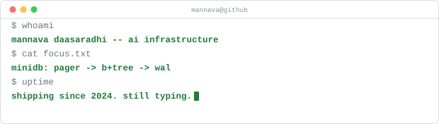

[linkedin](https://linkedin.com/in/mannava-daasaradhi) &nbsp;·&nbsp;
[email](mailto:daasaradhimannava@gmail.com)

> I build the systems that make ML and LLMs run in production. 
> B.Tech in AI &amp; Data Science, Amrita Vishwa Vidyapeetham, 2024–2028 · CGPA 9.2.

That means the whole column, not one layer of it: the MLOps primitives underneath 
a platform, the serving stack that exposes a model with A/B testing and drift 
alerts on top of it, and — because it all eventually rides on somebody else's 
abstraction — a Raft consensus store in Go and a userspace TCP/IP stack in Rust, 
written to find out what that abstraction actually does.

First-author applied-ML research under review, in multimodal sensor-vision fusion 
and graph-based intrusion detection.

Open to remote internships · IST, and I work the US-hours overlap.

**[MiniFlow-Serving](https://github.com/Mannava-Daasaradhi/MiniFlow-Serving)** &nbsp;·&nbsp; <samp>python, fastapi, docker</samp> 
A model-serving stack: FastAPI `/predict` with sticky A/B assignment, PSI drift 
detection on a background loop, Prometheus into Grafana, the whole thing up under 
Docker Compose. The A/B arm is decided by a two-proportion z-test — B won at 
p=0.012, +34% lift. p99 97 ms end-to-end under `hey`; 89% test coverage.

**[MiniFlow](https://github.com/Mannava-Daasaradhi/MiniFlow)** &nbsp;·&nbsp; <samp>python</samp> 
The three primitives every ML platform is built on, reimplemented with zero 
dependencies: an `ExperimentTracker` (SQLite-backed run logging and comparison), a 
`ModelRegistry` (versioned save/load with metadata), and a `FeatureStore` (schema'd, 
versioned, entity-keyed). 24 tests, 82% coverage. The point was to understand 
MLflow, W&amp;B and Feast by rebuilding them.

**[Distributed Raft KV](https://github.com/Mannava-Daasaradhi/Distributed_Raft_KV)** &nbsp;·&nbsp; <samp>go</samp> 
Raft consensus behind a linearizable KV store: leader election, log replication, 
snapshotting and log compaction, disk persistence with crash recovery, a 
consistent-hashing ring, and a five-node Docker Compose cluster. `kill -9` the 
leader and a new one is elected in under 700 ms with committed data intact. CI runs 
vet, build and `test -race`; 76% coverage on the consensus core.

**[tcp-stack](https://github.com/Mannava-Daasaradhi/tcp-stack)** &nbsp;·&nbsp; <samp>rust</samp> 
A userspace TCP/IP stack over a TUN device — ARP, IPv4, ICMP, UDP and TCP, with 
CUBIC and BBR congestion control, segment reassembly and RTT estimation on a 
non-blocking event loop. Designed to interoperate with the standard Linux userspace 
tools. 153 tests.

**[LLM from Scratch](https://github.com/Mannava-Daasaradhi/LLM_from_Scratch)** &nbsp;·&nbsp; <samp>python, pytorch</samp> 
A transformer language model end to end — BPE tokenizer, multi-head attention, 
RoPE, the full training loop — trained on a Shakespeare corpus. Built to own the 
internals rather than import them.

**[StudyMetrics](https://github.com/Mannava-Daasaradhi/StudyMetrics)** &nbsp;·&nbsp; <samp>kotlin, android</samp> 
A shipped Android app built as 18 CI-gated Gradle modules, because one module is a 
script and eighteen is an architecture. [Battleship](https://github.com/Mannava-Daasaradhi/Battleship_android) shipped alongside it.

**[S-XG-NID](https://github.com/Mannava-Daasaradhi/S-XG-NID)** &nbsp;·&nbsp; <samp>graph ml, xai, security</samp> 
A heterogeneous GNN over network flows (CICIDS) with a knowledge-graph reasoning 
stage, so every detection carries an LLM-written explanation of why it fired. 
First author. Manuscript under review.

**[FabMind](https://github.com/Mannava-Daasaradhi/FabMind-Semiconductor-AI)** &nbsp;·&nbsp; <samp>multimodal, manufacturing</samp> 
Semiconductor yield prediction by late fusion of IoT sensor time-series with 
wafer-map vision — 591 sensor features against 4096 image features — with the 
explainability tooling to go with it. First author. Manuscript under review.

